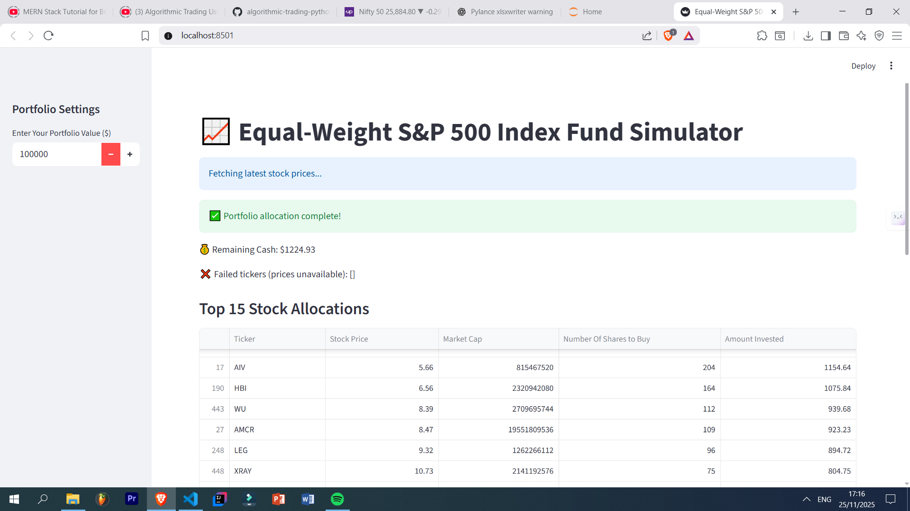

# 📈 S&P 500 Analysis Toolkit

A Python-based toolkit for analyzing S&P 500 stock data — including data cleaning, equal-weight index generation, exploratory analysis, and strategy experimentation.  
This project contains multiple scripts, notebooks, and cleaned datasets to help you work with S&P 500 stock lists and perform custom analysis.


## Project Overview

This repository contains:

- Python scripts for cleaning data, exploring S&P 500 stock components, and computing variations like equal-weight indices.
- Jupyter Notebook for deeper analysis (`finalsandp.ipynb`).
- Cleaned datasets and S&P 500 stock lists (Excel format).
- Helper modules such as `my_secrets.py` and initialization script.


## 🧠 Features

- Read and clean S&P 500 stock lists  
- Remove duplicates, handle missing values  
- Generate equal-weight S&P 500 data  
- Export processed Excel files  
- Run modular scripts for different parts of analysis  
- Notebook-based experimentation (`finalsandp.ipynb`)


##  Project Structure

```bash
ema-trading-simulator/
│
├── src/
│   ├── app.py             # Main Streamlit app
│   ├── data_fetcher.py    # Fetches live/cached/synthetic stock data
│   ├── strategy.py        # EMA strategy logic
│   ├── portfolio.py       # Portfolio management & summary
│   └── utils.py           # Plotting and visualization functions
│
├── data/                  # Cached CSV stock data
├── run.py                 # Entry point
├── requirements.txt       # Python dependencies
└── README.md

```

## Installation & Setup  

### Clone the Repo

```bash
git clone https://github.com/SHAUNSET/sandp500
cd sandp500
```

### Install Dependencies
```bash
pip install -r requirements.txt
```

##  Usage

```bash
python sandp500.py
```

Run cleaned-final workflow
```bash
python final.py
```


## Screenshots / Demo  

  

## Tech Stack

- **Python** — core programming & data manipulation  
- **Pandas** — reading, cleaning, transforming Excel files  
- **NumPy** — numerical operations  
- **OpenPyXL** — Excel file handling  
- **Jupyter Notebook** — interactive analysis  
- **Git** — version control  

## Lessons Learned

### Data Processing
- Cleaning raw financial datasets  
- Handling missing values & inconsistencies  
- Converting between raw and cleaned Excel files  

### Project Structuring
- Splitting logic across multiple scripts  
- Using notebooks for exploration and scripts for final workflows  

### Financial Understanding
- Working with S&P 500 component lists  
- Understanding equal-weight vs market-cap weighting  

### Engineering Skills
- Keeping secrets out of GitHub (`my_secrets.py`)  
- Using `.gitignore` effectively  
- Maintaining modular scripts for clarity  


##  Future Enhancements

- Add live data fetching (Yahoo Finance / API)  
- Create visualizations for sector distributions  
- Build Streamlit dashboard for S&P 500 analytics  
- Add requirements.txt for easier setup  


## Contributing  

Contributions are welcome!  
- Fork the repo  
- Create a new branch (`git checkout -b feature/my-feature`)  
- Commit your changes (`git commit -m "Add my feature"`)  
- Push to branch (`git push origin feature/my-feature`)  
- Open a Pull Request  

Ensure code style consistency and include testing steps in your PR message.

## License

This project is licensed under the MIT License.

